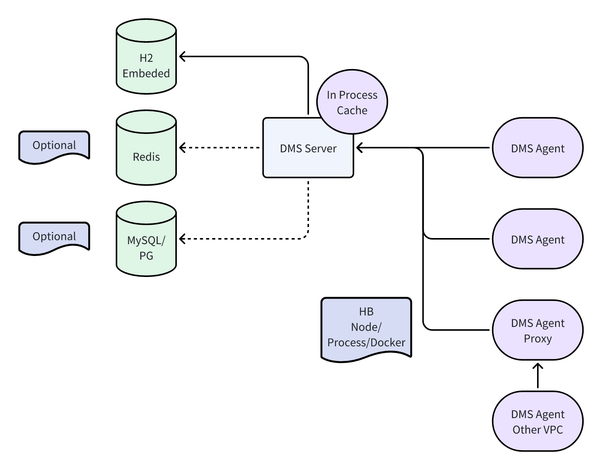
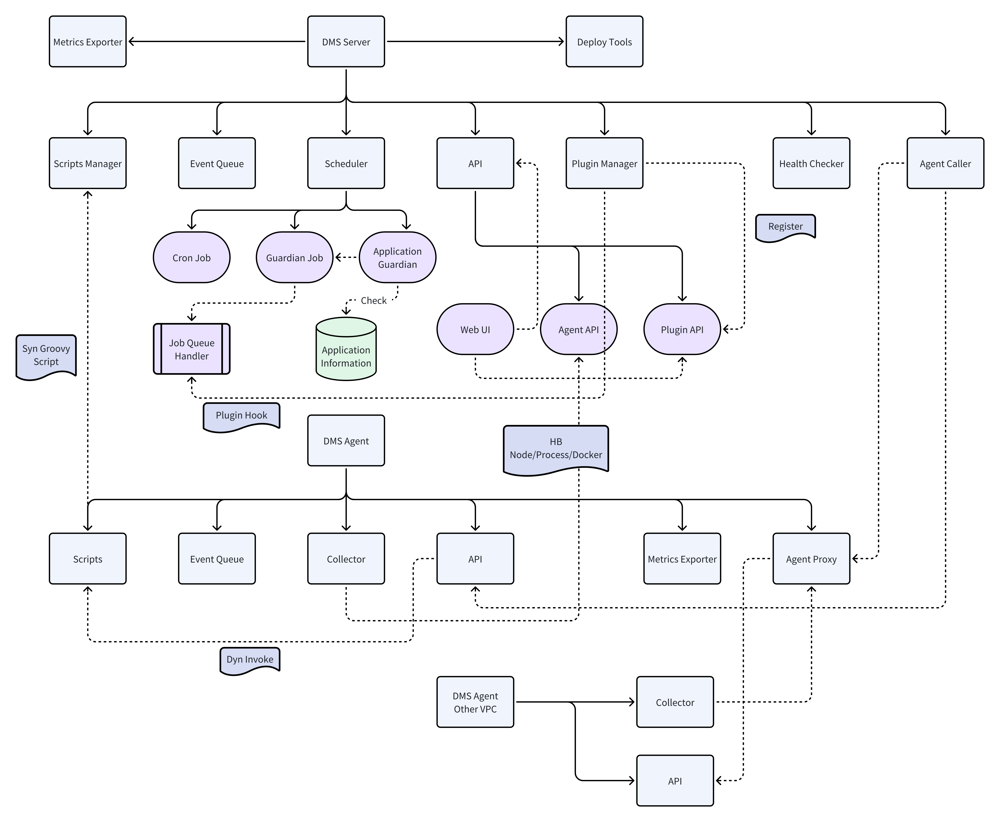
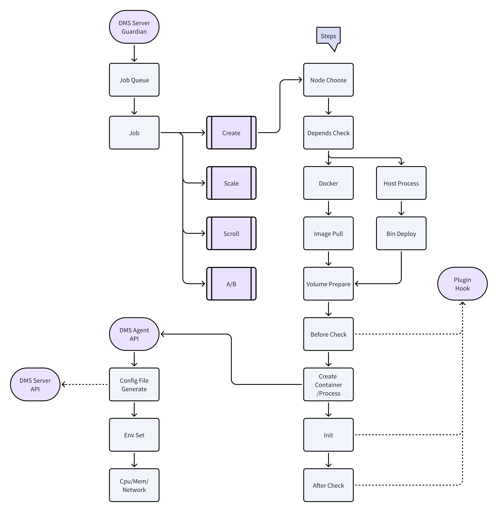
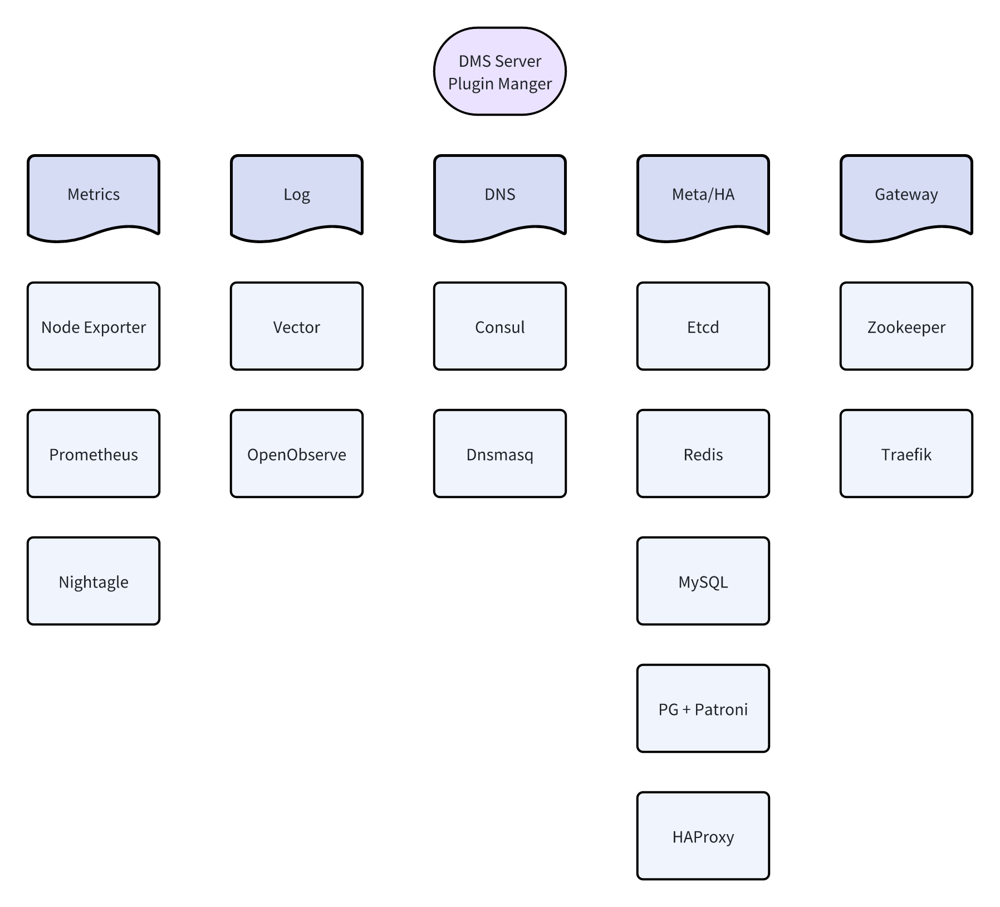
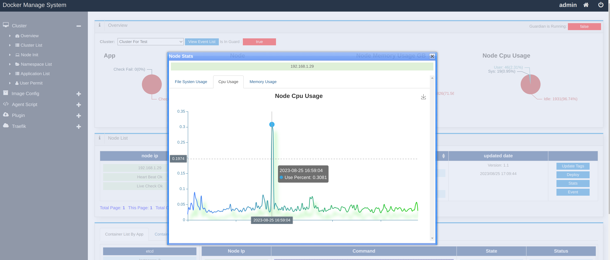
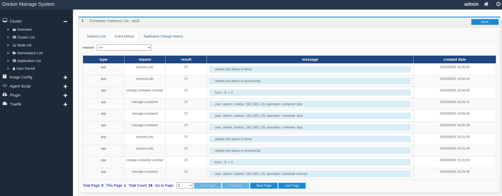
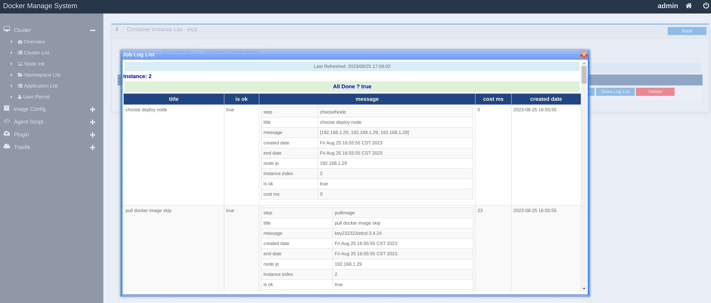

# dms
A docker instances manage system like k8s write in java/groovy, including web ui.

# Features

- docker instance management
- host machine process management
- web ui
- work node init
- application configuration files are generated by groovy template
- stateful application support
- hpa
- A/B tests
- traefik http gateway like k8s ingress
- metrics collect by prometheus, auto reload jobs like k8s service monitor
- log collect by vector and open observe
- plugins support like k8s operator
- multi-region worker node support by underlay network

# Architecture

## dms server agent overview


## dms server agent modules


## create container/process steps


## dms build-in plugins


## dms redis-manager

[README_redis_manager.md](README_redis_manager.md)

# Quick start

## run dms server

### prepare conf.properties

```properties
# change here
dbDataFile=/var/lib/dms/db;FILE_LOCK=SOCKET
```

### run in docker

```bash
docker run -d --name dms_server --net=host -v /var/log/dms:/var/log/dms -v /var/lib/dms:/var/lib/dms -v $pwd/conf.properties:/opt/dms/conf.properties -e ADMIN_PASSWORD=123456 -e LOCAL_IP_FILTER_PRE=192. key232323/dms_server:1.2.1
```

Then open http://your-ip:5010/
Input user/password and login -> admin/123456

### or run by compiling from source

TIPS: Need jdk21+/gradle8+

```bash
cd ~/ws
git clone git@github.com:segment11/dms.git
cd dms
git submodule update --init
cd ~/ws/dms/dms_agent
gradle tar
cd ~/ws/dms/dms
gradle buildToRun
cd ~/ws/dms/dms/build/libs & java -cp . -jar dms_server-1.2.jar
```

## run dms agent

### prepare conf.properties

```properties
# change here
serverHost=dms_server_ip
serverPort=5010
clusterId=1
secret=1
collectDockerDaemon=1
server.runtime.jar=1
```

### run in docker

```bash
docker run -d --name dms_agent --cpu-period 1000000 --cpu-quota 250000 --net host -v /var/log/dms:/var/log/dms -v /opt/dms/config:/opt/dms/config -v /var/run/docker.sock:/var/run/docker.sock -v $pwd/conf.properties:/opt/dms_agent/conf.properties key232323/dms_agent:1.2.0
```

### or run by compiling from source

TIPS: Need jdk21+, and root user

```bash
su
cd ~/ws/dms/dms_agent/build/libs
nohup java -Xms128m -Xmx256m -Djava.library.path=. -cp . -jar dms_agent-1.2.jar > /dev/null 2>&1 &
```

# Screenshots

- cluster overview


- cluster container overview by node ip


- worker node init


- node cpu stats 



- application list


- one application container list


- one application event list



- job steps log



# Author contact

- wechat: key232323
- email: dingyong87@163.com
