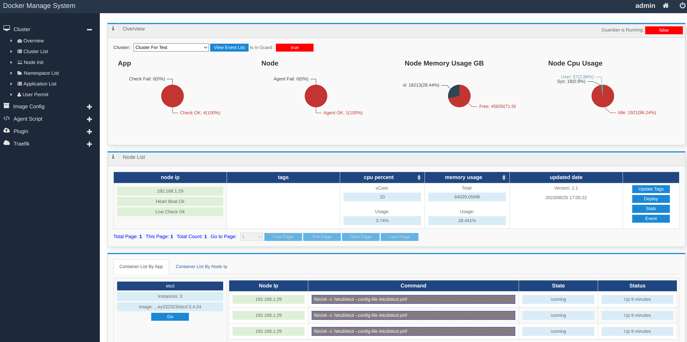
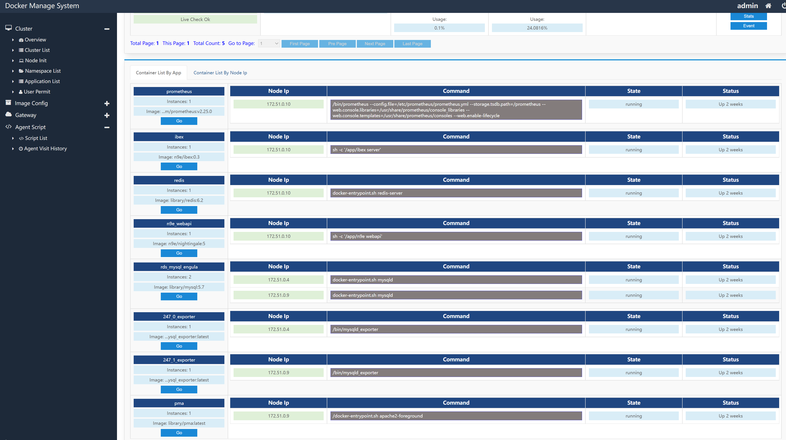
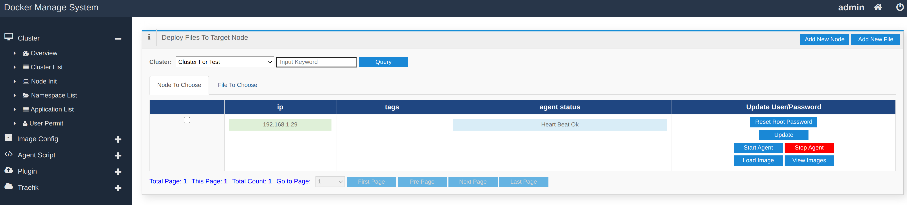
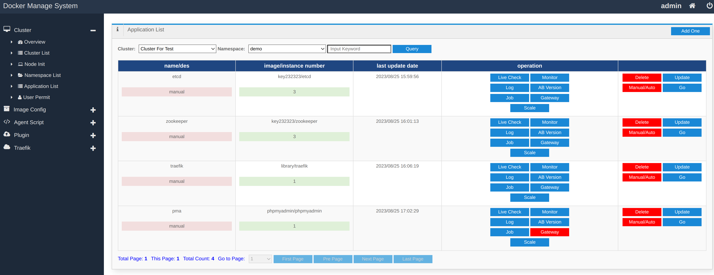

# dms
A docker instances manage system like k8s write in java/groovy, including web ui.

# features

- docker containers management
- node process management
- web ui
- work node init
- application configuration files are generated by groovy template
- stateful application support
- hpa
- A/B test using different docker image tags
- traefik http gateway like k8s ingress
- monitor by prometheus, auto reload jobs
- log by vector and zincobserve

# run dms server

- docker run -v /ws/dms:/ws/dms --name=dms --net=host key232323/dms
- open http://your-ip:5010/admin/login.html user/password -> admin/123456

# or run dms server by compiling from source

TIPS: Need jdk8+/gradle6+

- cd /ws
- git clone git@github.com:segment11/dms.git
- cd /ws/dms/dms_agent
- gradle tar
- cd /ws/dms/dms
- gradle buildToRun
- cd /ws/dms/dms/build/libs & java -cp . -jar dms_server-1.1.jar
- open http://your-ip:5010/admin/login.html user/password -> admin/kerry123456

# run dms agent

- cd /ws/dms/dms_agent/build/libs
- vi conf.properties

```properties
# change to your dms server ip
serverHost=192.168.1.1
# change to your host ip prefix
localIpFilterPre=192.
# there is cluster demo cluster with id=1 and secret=1
clusterId=1
secret=1
```

- java -Djava.library.path=. -cp . -jar dms_agent-1.0.jar

### TIPS:
run 'java -Djava.library.path=. -cp . -jar dms_agent-1.0.jar' on another node, will add this node as a work node to target dms cluster.


# screenshots

- cluster overview











# author contact

- wechat: key232323
- email: dingyong87@163.com
