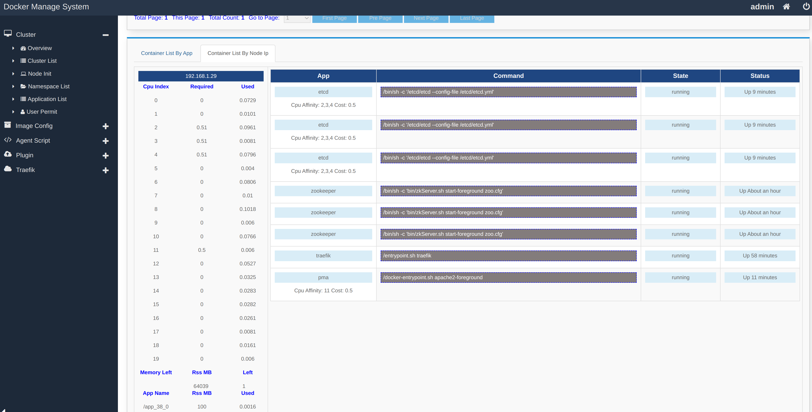
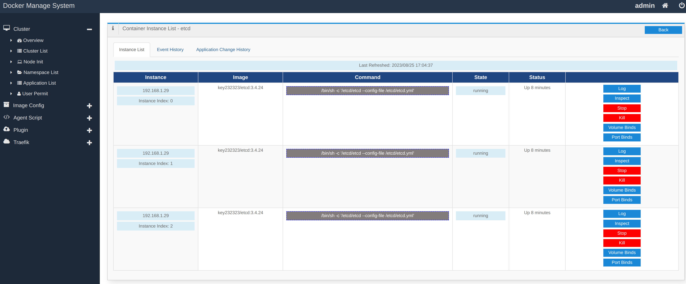

# dms
A docker instances manage system like k8s write in java/groovy, including web ui.

# features

- agent deploy/init
- docker containers management
- application configuration files are generated by groovy template
- stateful application support
- hpa
- A/B test using different docker image tags
- monitor by prometheus/auto reload jobs
- traefik http gateway like k8s ingress

# run dms server

- docker run -v /ws/dms:/ws/dms --name=dms --net=host key232323/dms

# steps compile and run

- git clone dms -> /ws/dms
- git clone segment/segmentd -> /ws/segmentd
- git clone segment/segmentweb -> /ws/segmentweb
- install Gradle
- cd /ws/dms/dms_agent & gradle buildToRun
- cd /ws/dms/dms & gradle buildToRun
- cd /ws/dms/dms/build/libs & java -cp . -jar dms_server-1.0.jar
- cd /ws/dms/dms_agent/build/libs
- vi conf.properties -> change serverHost -> your ip
- java -Djava.library.path=. -cp . -jar dms_agent-1.0.jar
- open http://your-ip:5010/admin/login.html
- user/password -> admin/admin

### TIPS:
run 'java -Djava.library.path=. -cp . -jar dms_agent-1.0.jar' on another node, will add this node to dms cluster.

# screenshots

- cluster overview

# author contact

- wechat: key232323
- email: dingyong87@163.com