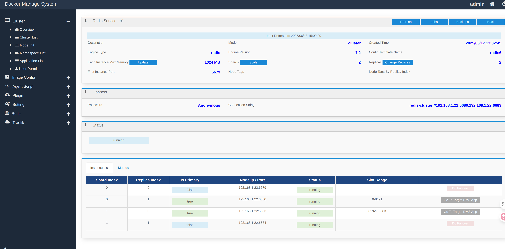
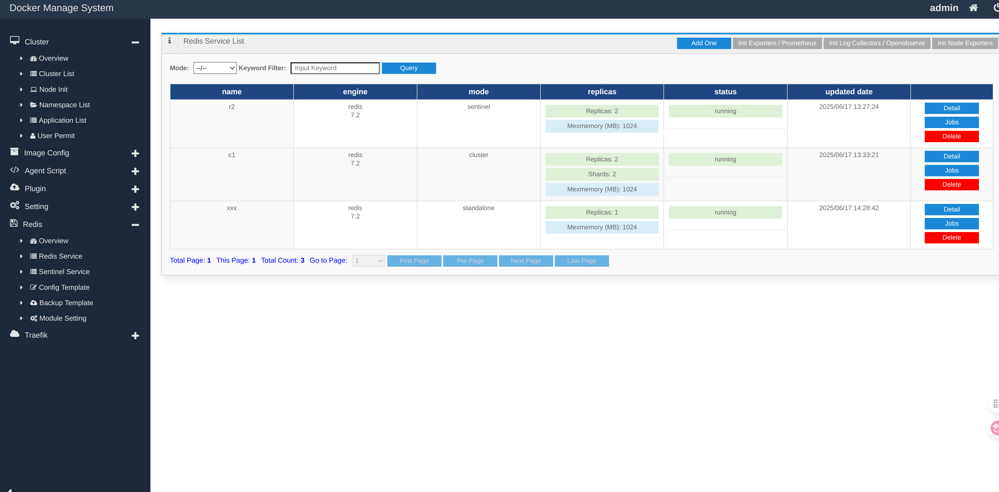
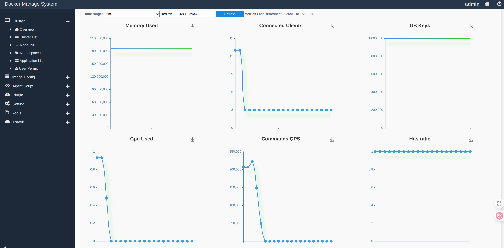
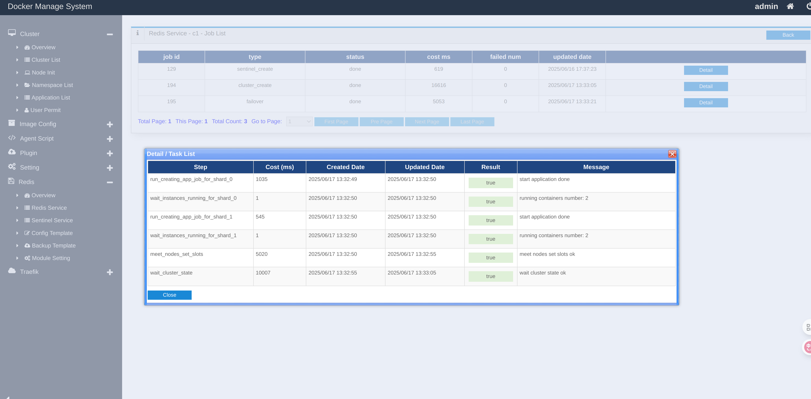
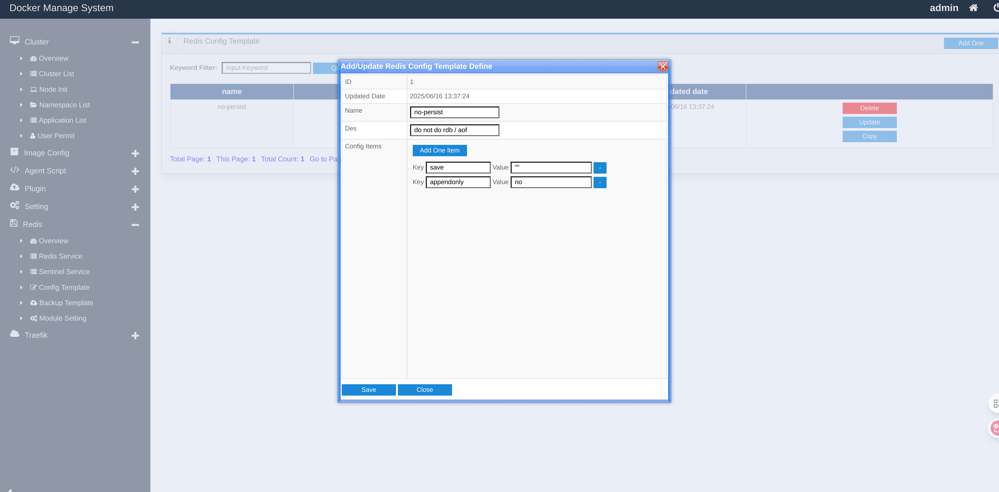
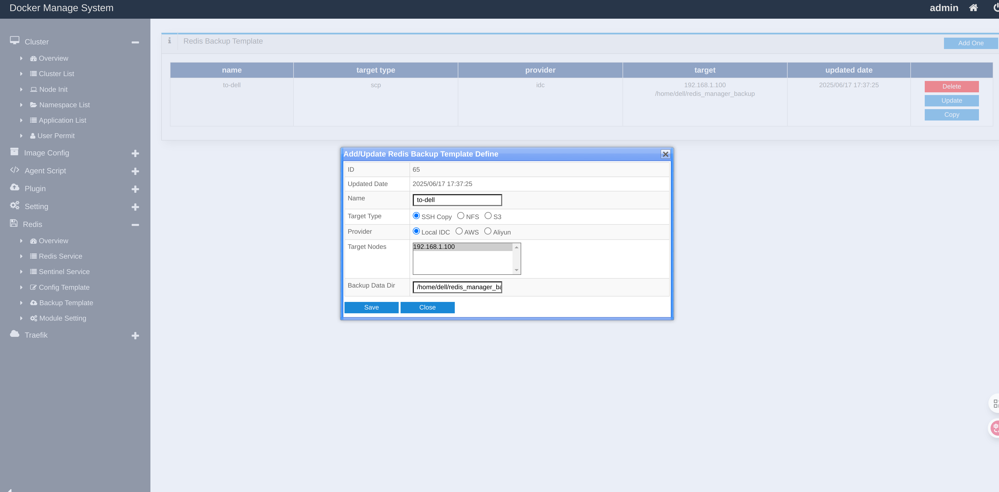

# dms redis manager

This is a module + some plugins in dms, it's a manager system for redis.

# Features

- redis config management
- redis cluster creation
- redis sentinel creation
- redis primary-replicas creation
- scale out redis cluster
- redis sentinel auto-failover
- add and remove replicas
- auto backup and recover by scp or s3 in cloud
- node exporter, redis exporter and prometheus, one button to collect metrics
- vector log collect and loki, one button to collect logs
- some basic metrics charts
- Node resource overview

# Some screenshots

One redis service overview:

Service list:

Metric Charts:

Job task log:

Config template:

Backup template:
